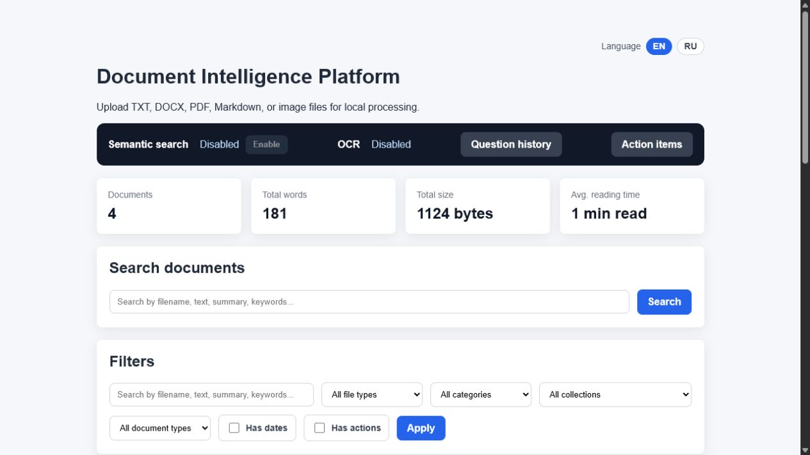
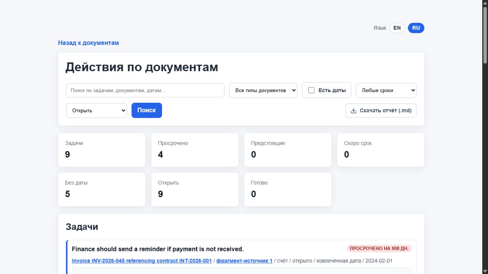
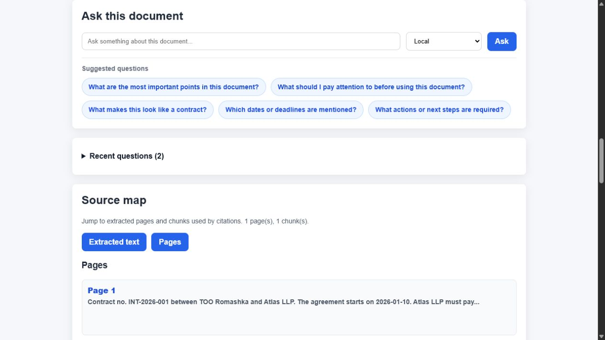
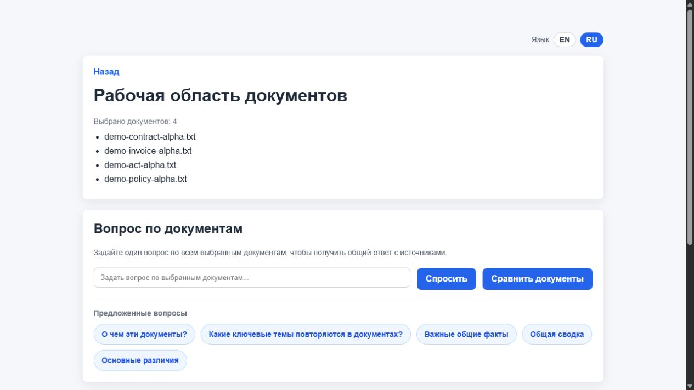
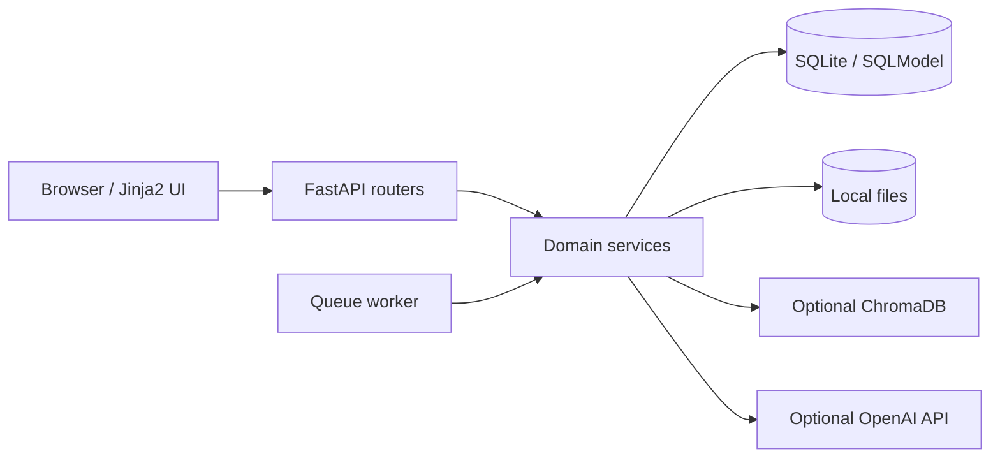
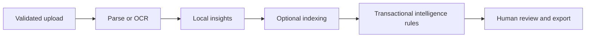

# Document Intelligence Platform

A local-first workspace for uploading, reading, searching, comparing, and extracting structured information from documents.

I originally built this project for my own use: I wanted one private place where I could work with TXT, Markdown, DOCX, PDF, and scanned documents without making a cloud AI provider mandatory. As the project grew, I turned it into a polished portfolio case study that shows how I approach backend architecture, data integrity, testing, failure handling, and product trade-offs.

I am preparing for my first commercial backend role, so this repository is intentionally transparent about what is production-inspired, what is simplified for a personal application, and what I would build next in a real team environment.

> **Portfolio context:** this is an independently designed and developed pet project for personal use and technical learning. It is not presented as previous commercial work, a production SaaS, or legal-grade document analysis.

## Why I built it

Many document AI demos stop after upload, chunking, retrieval, and chat. For my own workflow, I wanted the result to remain useful even without an API key and to produce inspectable data rather than only a generated answer.

That led to three main design goals:

- **Local-first operation:** parsing, summaries, keyword search, QA fallback, and rule-based intelligence work without external AI services.
- **Traceable results:** entities, relations, obligation candidates, risks, source text, and processing state are stored explicitly and can be reviewed.
- **Engineering depth:** migrations, retries, stale-job recovery, transactional recomputation, cleanup rules, exports, CI, and regression tests are part of the project—not afterthoughts.

## Product tour

The gallery intentionally shows both supported interface languages: English and Russian.

| Document library | Action dashboard |
| --- | --- |
|  |  |

| Document detail | Multi-document QA |
| --- | --- |
|  |  |

The main workflow covers:

1. Validating and storing uploaded files.
2. Extracting text directly or through an optional OCR fallback.
3. Building local summaries, keywords, document type, dates, actions, and suggested questions.
4. Optionally indexing chunks in ChromaDB for semantic retrieval.
5. Extracting entities, document links, obligation candidates, and risk indicators.
6. Reviewing results through Jinja2 pages or JSON endpoints and exporting selected content.

## Engineering highlights

- FastAPI application with separate routers, services, schemas, models, templates, and migrations.
- SQLModel and SQLite with foreign-key enforcement and cascade cleanup.
- Alembic as the schema source of truth; application startup does not create tables implicitly.
- Atomic intelligence recomputation: partial replacements are rolled back if a rule fails.
- Explicit document lifecycle cleanup for SQL records, vector chunks, and stored files.
- Synchronous and queued processing modes with retries, attempt limits, and stale-job recovery.
- Optional OpenAI QA and embeddings with local keyword fallbacks.
- Optional Tesseract/Poppler OCR for scanned PDFs and images.
- Markdown, DOCX, and PDF exports.
- Isolated tests, deterministic extraction evaluation, Ruff checks, coverage enforcement, migration verification, and Docker smoke tests in CI.

## Architecture





More detail is available in [docs/ARCHITECTURE.md](docs/ARCHITECTURE.md).

## Technology stack

| Layer | Tools |
| --- | --- |
| Web | FastAPI, Uvicorn, Jinja2 |
| Data | SQLModel, SQLAlchemy, SQLite, Alembic |
| Documents | pypdf, python-docx, docx2txt, Pillow |
| OCR | Tesseract, Poppler, pytesseract, pdf2image |
| Optional AI | OpenAI API, ChromaDB |
| Quality | pytest, pytest-cov, Ruff, GitHub Actions |
| Delivery | Docker, Docker Compose |

## Run locally

Requirements:

- Python 3.12;
- PowerShell for the helper script;
- Docker Desktop as an alternative to local Python setup;
- Tesseract and Poppler only when local OCR is needed.

### Windows helper

```powershell
.\scripts\dev.ps1 bootstrap
.\scripts\dev.ps1 run
```

Open `http://127.0.0.1:8000`.

### Manual setup

```powershell
python -m venv .venv
.\.venv\Scripts\Activate.ps1
pip install -r requirements-dev.txt
Copy-Item .env.example .env
alembic upgrade head
python -m app.seed_demo
uvicorn app.main:app --reload
```

### Docker

```powershell
docker compose up --build
```

The image applies Alembic migrations before starting Uvicorn. Runtime data is stored under `./data` and excluded from version control.

## Tests and measurable quality

```powershell
pytest
ruff check app tests alembic scripts
ruff format --check app tests alembic scripts
python -m scripts.evaluate_intelligence
```

At the time of this portfolio update:

- the suite contains more than 180 passing tests;
- measured application coverage is above the enforced 70% threshold;
- the bilingual labeled regression set reports entity/risk precision and recall plus obligation-detection accuracy;
- CI also verifies migrations from an empty database and starts the built Docker image before checking `/health`.

The extraction dataset is intentionally small. Its metrics protect deterministic behavior from regressions; they are not claims of production accuracy on arbitrary legal or business documents.

## Optional features

### Semantic search and LLM QA

The application is useful without credentials. To enable semantic search, set `OPENAI_API_KEY` and use the runtime switch on the home page. If the integration is disabled or unavailable, retrieval falls back to local keyword matching.

### OCR

OCR is optional and depends on system Tesseract and Poppler binaries. The Docker image includes English and Russian language data. See [docs/DEVELOPMENT.md](docs/DEVELOPMENT.md) for local setup.

### Queued processing

Set `PROCESSING_MODE=queued` and run:

```powershell
python -m app.worker
```

## Decisions and trade-offs

- **SQLite instead of PostgreSQL:** appropriate for a single-user local tool; switching databases would become relevant with concurrent users or deployment.
- **Relational document graph instead of Neo4j:** exact entity relationships do not currently justify a second database.
- **Deterministic rules before LLM extraction:** easier to inspect, test, and evaluate while the labeled dataset is still small.
- **Server-rendered UI instead of a SPA:** keeps the project focused on backend and product workflows.
- **Optional cloud integrations:** external services enhance retrieval and QA but do not control basic availability.
- **No authentication:** acceptable only for a trusted local installation; shared deployment would require ownership, permissions, CSRF protection, and an explicit threat model.

## Current limitations

- Intelligence results are heuristic candidates for human review, not legal advice.
- Rule scores are not calibrated probabilities.
- Document relations use normalized exact matches rather than semantic reasoning.
- OCR and model calls can occupy a web worker in synchronous mode.
- The graph UI is tabular rather than interactive.
- The evaluation corpus is small and mostly synthetic.
- There is no authentication, multi-tenancy, or production audit trail.

## What I would build next

1. Expand the evaluation corpus with anonymized real layouts and difficult negative examples.
2. Move OCR and model workloads behind a durable queue when the workload justifies it.
3. Add explanations showing exactly which rule and evidence produced each result.
4. Build an interactive graph view over the existing nodes-and-edges API.
5. Add user ownership and permissions only if the project evolves beyond personal local use.

## Documentation

- [Architecture](docs/ARCHITECTURE.md)
- [Development guide](docs/DEVELOPMENT.md)
- [API reference](docs/API.md)
- [Database notes](docs/DATABASE.md)
- [Resolved bug reports (Russian)](docs/BUG_REPORTS_RU.md)

## Repository status

This is a personal portfolio repository and is actively evolving. It is public for review by recruiters, engineers, and potential employers, but it is not maintained as a community open-source project. No open-source license is granted.

Secrets, local databases, uploads, vector data, runtime settings, caches, coverage artifacts, and virtual environments are excluded through `.gitignore`.
