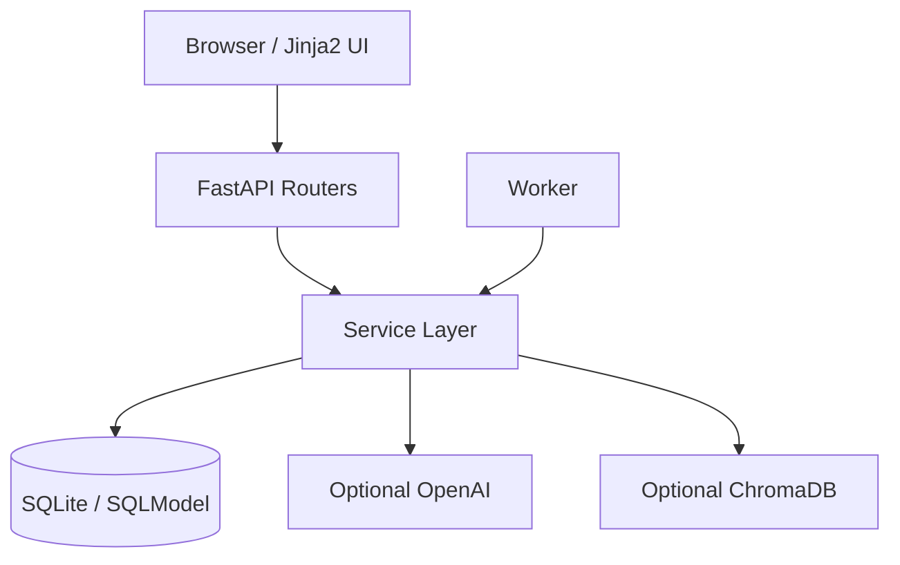
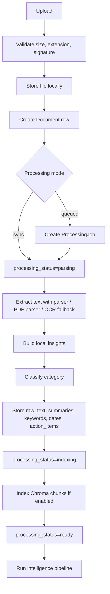
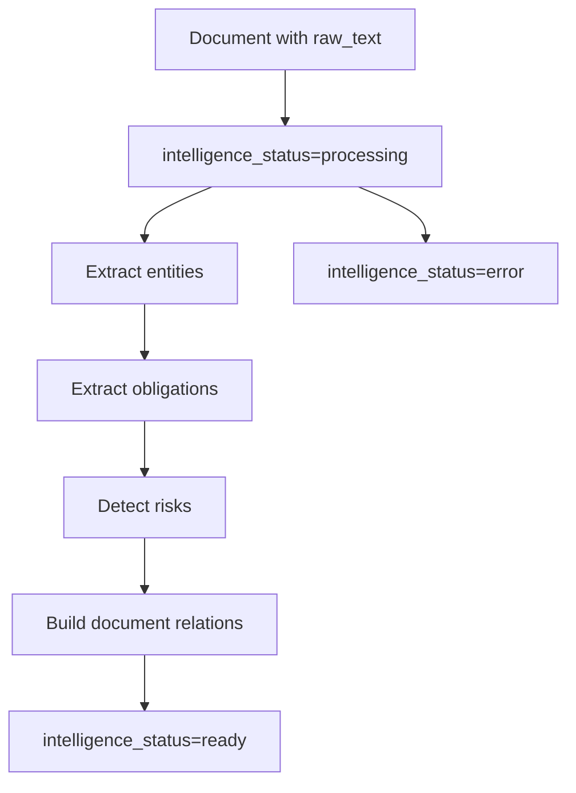
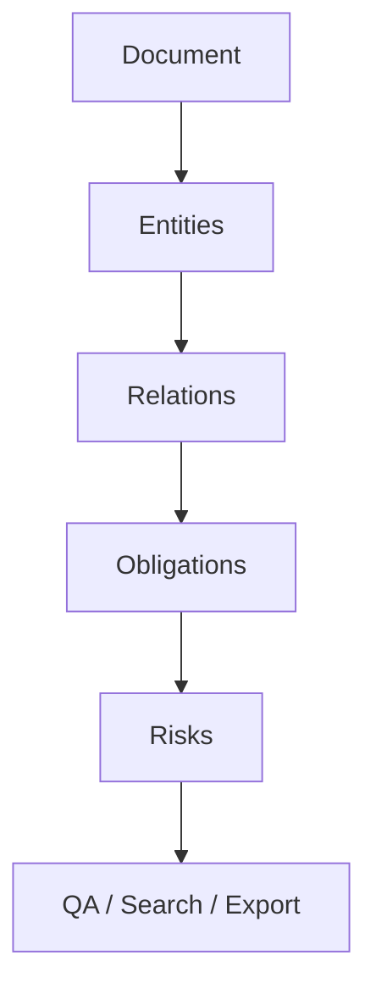

# Architecture

Document Intelligence Platform uses a deliberately small FastAPI + SQLModel architecture for a local educational project. There is no separate frontend framework or generic repository layer; domain-oriented services own multi-table lifecycle operations.

## System Design

## Main Components

- `app/main.py`: creates the FastAPI app, mounts static assets, and registers routers.
- `app/db/models.py`: all SQLModel table definitions.
- `app/routers/`: JSON API routes and HTML/form routes.
- `app/services/`: parsing, summarization, QA, exports, jobs, OCR, vector search, and intelligence logic.
- `app/services/document_lifecycle.py`: transactional database cleanup and post-commit file cleanup.
- `app/services/intelligence_evaluation.py`: deterministic evaluation harness for the labeled regression dataset.
- `app/templates/`: Jinja2 pages.
- `app/static/`: CSS and small JavaScript for job polling.
- `app/worker.py`: queued job worker.
- `alembic/versions/`: database migrations.
- `tests/`: pytest suite.

Alembic owns the application schema. `create_all()` is used only by isolated tests and the deterministic evaluation helper, not by web application startup or demo seeding.

## Processing Pipeline

## Intelligence Pipeline

Entities, obligations, risks, and relations are replaced in one database transaction. If a rule fails, the transaction rolls back and the previous consistent artifacts remain available. A separate status update records the failure.

## Data lifecycle

- SQLite foreign keys are enabled for every application connection.
- Document-owned tables use `ON DELETE CASCADE` after migration `20260717_0013`.
- The lifecycle service explicitly removes dependent rows as a compatibility measure for older local databases.
- Chroma chunks and the stored file are removed after the relational transaction commits.
- Rebuilding the workspace graph is a POST operation because it changes persisted state.

## Intelligence Model

## Notes

- The graph is stored in relational tables, not Neo4j.
- The `/graph` page is an HTML table view.
- Intelligence extraction is rule-based and designed for human review.
- Stored confidence values are rule scores, not calibrated probabilities.
- OpenAI and ChromaDB are optional.
